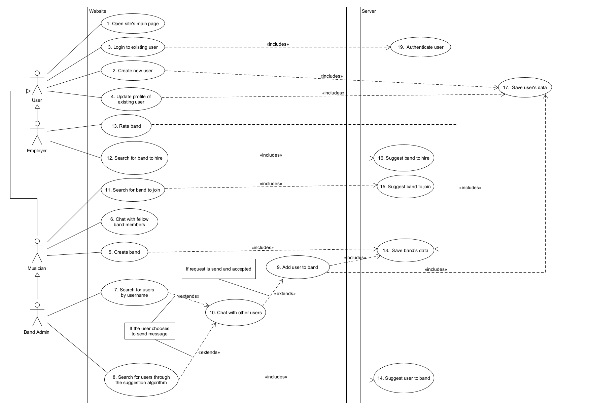
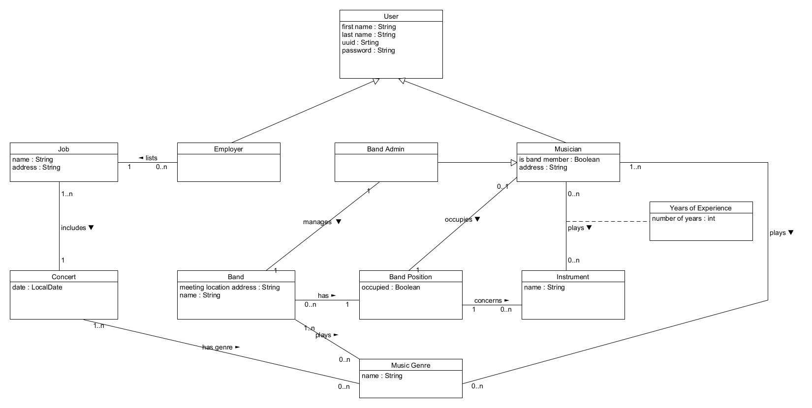
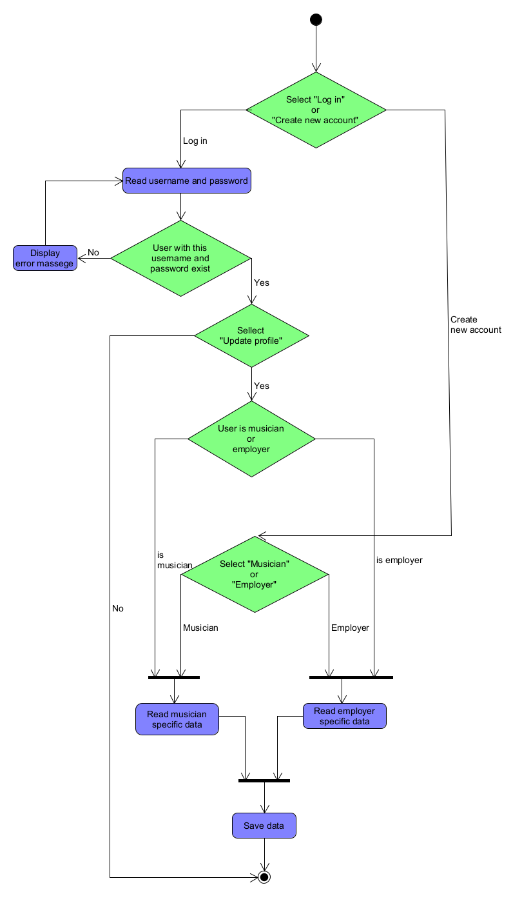
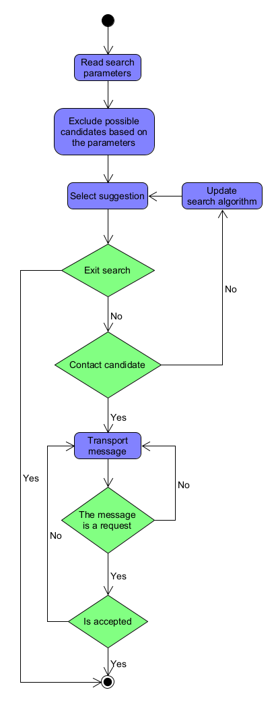

# Bandito

# Hibernate ddl auto (create, create-drop, validate, update)
spring.jpa.hibernate.ddl-auto= create 
 
## Discription 

A social networking application with the purpose to help musicians form bands and bands connect with employers.  

## Use Cases

1. Open site's main page
2. Create new user
3. Login to existing user
4. Update profile of existing user 
5. Create band
6. Chat with fellow band members
7. Search for users by unique code 
8. Search for users through the suggestion algorithm
9. Add user to band
10. Chat with other users
11. Search for band to join
12. Search for band to hire
13. Rate band
14. Suggest user to band
15. Suggest band to join
16. Suggest band to hire
17. Save user's data
18. Save band’s data
19. Authenticate user

### Use Case Diagram

## Domain Model

## Activities

### User Profile Management

### Search

## Note
For this project to work correctly on your pc you must create a application.properties with your postgr
 server username and password in Bandito\code\Backend\bandtito\src\main\resources
(resources folder does not exist it must also be created).For example  

server.port=9090
spring.datasource.url= jdbc:postgresql://localhost:5432/Bandito
spring.datasource.username= postgres
spring.datasource.password= password
spring.jpa.properties.hibernate.jdbc.lob.non_contextual_creation= true
spring.jpa.properties.hibernate.dialect= org.hibernate.dialect.PostgreSQLDialect