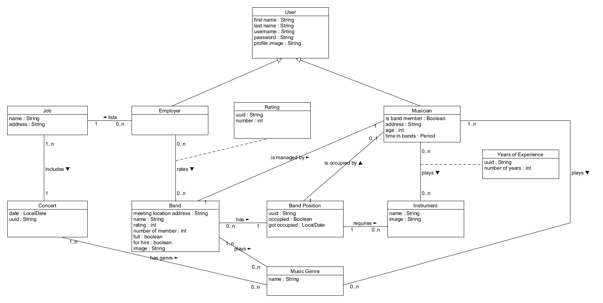

# Bandito
 
## Discription 

A social networking application with the purpose to help musicians form bands and bands connect with employers. 

Users can create a profile with their personal info. The type of information that a user must provide changes based on whether the user is a musician or potential employer. Musicians can create bands that have specific positions. This positions can be filled with musicians that are recommended to the band admin based on their preferences. If a musician wishes to join an existing band instead of creating a new one then the app recommends them band positions that are suitable for them. An employer can create jobs with specific requirements and then search for bands to hire. All searches take into account the choices that the person who conducts that search has made (ex. the musicians that an admin has contacted, the bands that an employer has contacted etc.) and returns similar results to their previous choices.

## Use Cases

1. Open site's main page
2. Create new user
3. Login to existing user
4. Update profile of existing user 
5. Create band
6. Chat with fellow band members
7. Search for users by username 
8. Search for users through the suggestion algorithm
9. Add user to band
10. Chat with other users
11. Search for band to join
12. Search for band to hire
13. Rate band
14. Suggest user to band
15. Suggest band to join
16. Suggest band to hire
17. Save user's data
18. Save band's data
19. Authenticate user

### Use Case Diagram

## Domain Model

## Activities

### User Profile Management

### Search

## Note
For this project to work correctly on your pc you must create a application.properties with your postgr
 server username and password in Bandito\code\Backend\bandtito\src\main\resources
(resources folder does not exist it must also be created). For example  

server.port=9090  
spring.datasource.url= jdbc:postgresql://localhost:5432/Bandito  
spring.datasource.username= postgres  
spring.datasource.password= password   

spring.jpa.properties.hibernate.jdbc.lob.non_contextual_creation= true  
spring.jpa.properties.hibernate.dialect= org.hibernate.dialect.PostgreSQLDialect  

spring.jpa.hibernate.ddl-auto= create  

